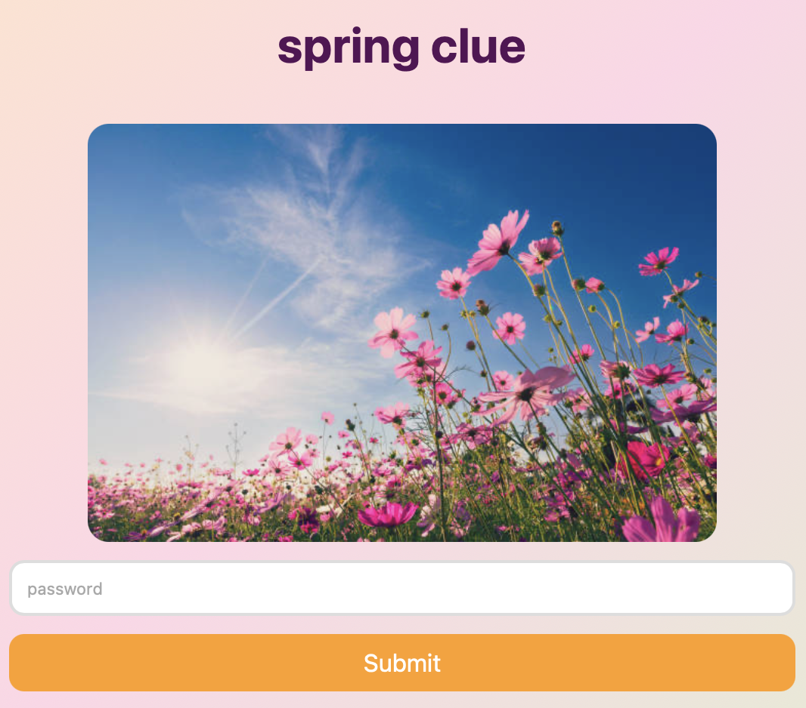
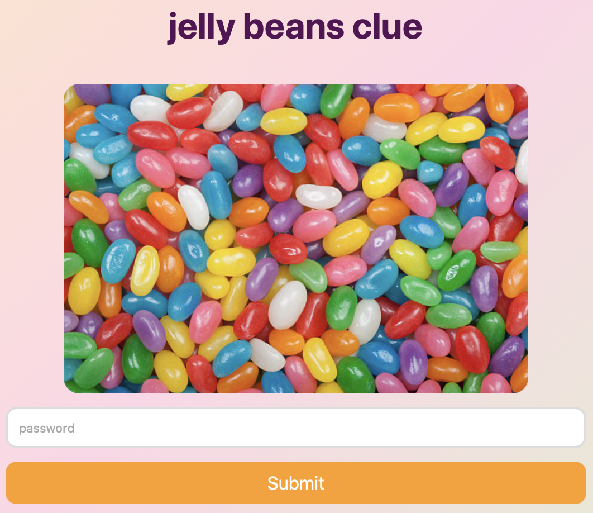
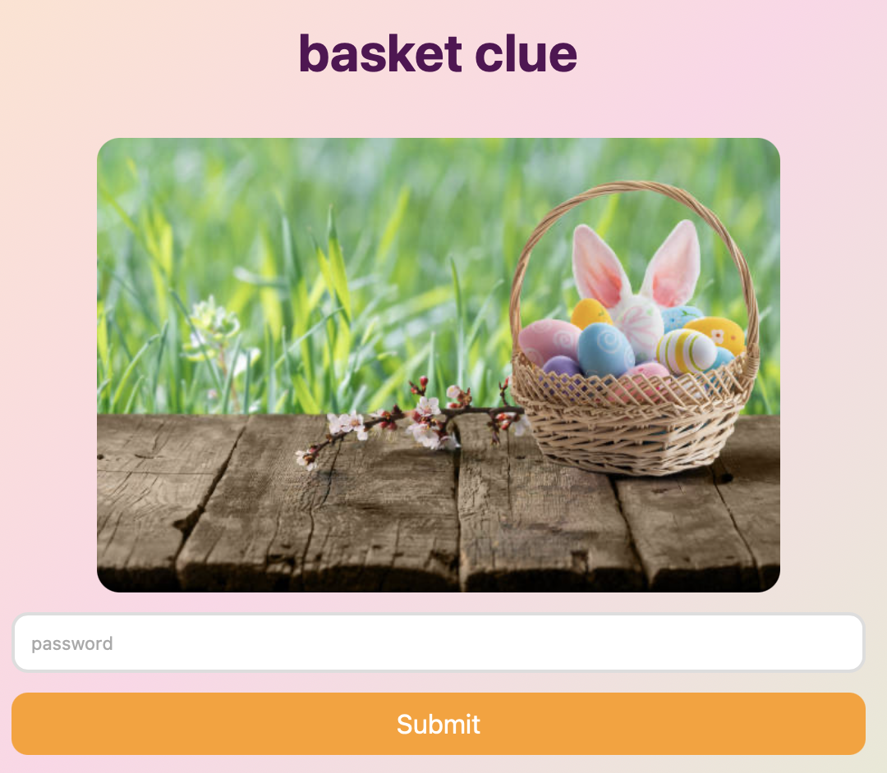
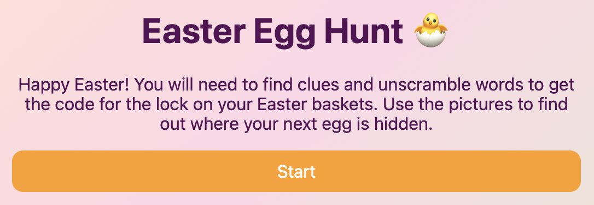
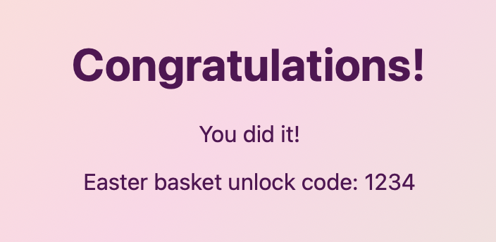
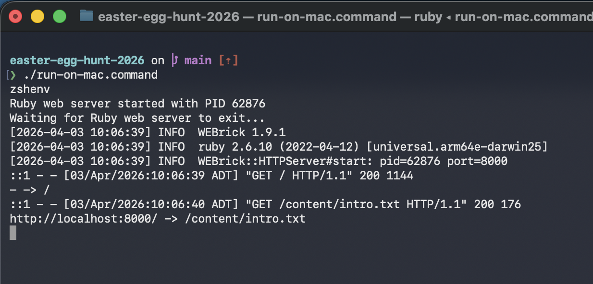

# Easter Egg Hunt

## Download The Website

_If you're already familiar with Git and GitHub, download the source using your preferred method._

1. Go to the [project homepage](https://github.com/patch-wreckless/easter-egg-hunt-2026).
2. Click `<> Code` then `Download ZIP`.
3. Extract the `easter-egg-hunt-2026-main.zip` file.
    - On Windows, right-click `easter-egg-hunt-2026-main.zip` and select `Extract all...`.
    - On Mac, double-click `easter-egg-hunt-2026-main.zip`.

## Create Your Content

Use the following files in the extracted website folder to configure the introduction message, clues, and success messages for the egg hunt:

**www/content/images/\***

Put the images you want to use in this folder.

**www/content/clues.json**

Use this file to define the list of clues.

Each clue is a piece of text that looks like this:

```json
{
    "heading": "<the optional text to show>",
    "image": "<the name of the image file to show>",
    "password": "<the password to unlock the next clue>"
}
```

The file is a list of clues, separated by commas, and surrounded by `[` and `]` characters. The website will show the clues in the order they appear in this file.

This is an example of a complete file with three clues:

```json
[
    {
        "heading": "spring clue",
        "image": "spring.jpg",
        "password": "spring"
    },
    {
        "heading": "jelly beans clue",
        "image": "jelly-beans.jpg",
        "password": "jelly beans"
    },
    {
        "heading": "basket clue",
        "image": "basket.jpg",
        "password": "basket"
    }
]
```







**www/content/intro.txt**

Use this file to configure the welcome message and instructions to show at the beginning of the egg hunt.



**www/content/success.json**

Use this file to define the messages to show when the egg hunt is successfully completed.

```json
{
    "successMessage": "You did it!",
    "finalClueLabel": "Easter basket unlock code",
    "finalClueValue": "1234"
}
```



## Run The Website

- On Windows, double-click [`run-on-windows.bat`](./run-on-windows.bat)
- On Mac, double-click [`run-on-mac.command`](./run-on-mac.command)

Running the website will open the website in your browser, and create a second window that looks something like this:



The text may be slightly different, especially on Windows, but the details aren't important. As long as that window is open the website is running and should be available at http://localhost:8000 in your browser. Trying to run the website when it's already running will not work, so make sure you close this window when you're finished.
